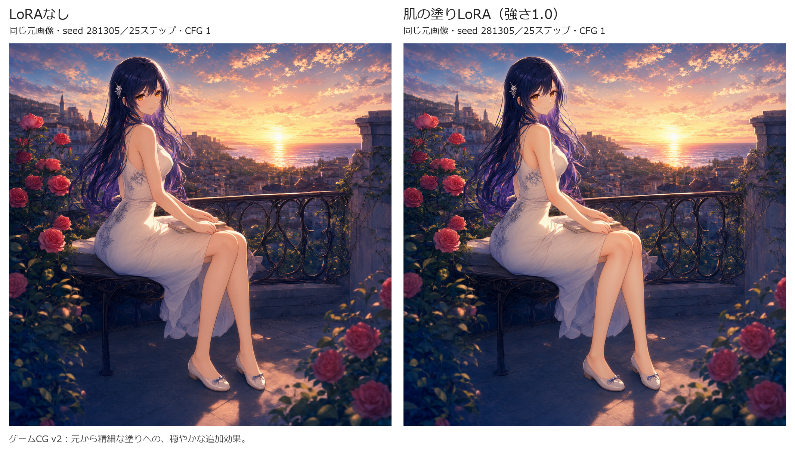
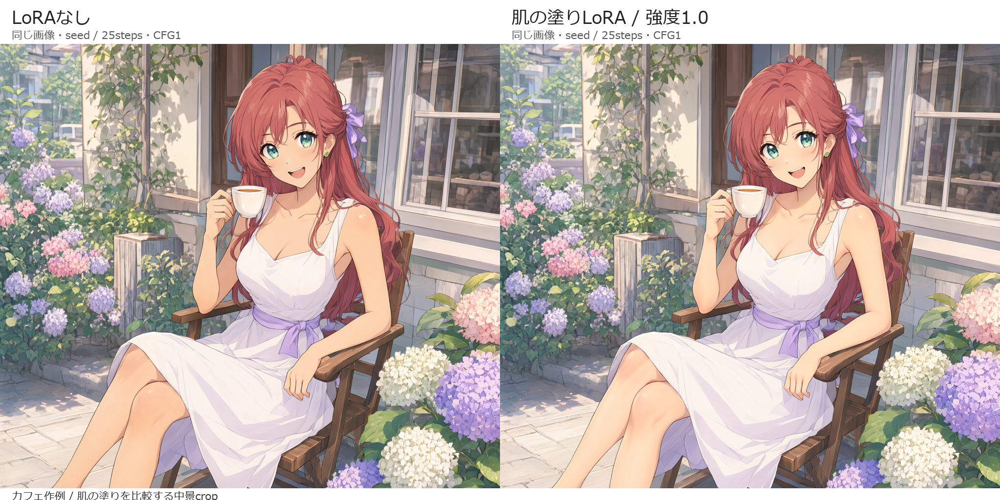

# Skin Paint LoRA for Qwen Image 2.1

**Built with Qwen.**

肌の中間色・柔らかな陰影・丸みを加える固定した塗り表現 `skin_paint_v1` の試作LoRAです。ComfyUIの画像編集で使います。肌のテカリだけでなく、陰影のつながりと塗り表現を扱います。

元画像1枚を編集する用途で、入力画像を変えて試せます。別の画風参照を入力して任意の肌質感を移すLoRAではありません。すでに柔らかく塗られたアニメ・ゲームCGでは、変化は穏やかです。

## ダウンロード

- [LoRA・説明資料・ライセンス一式：skin-paint-lora-image21-v1.0.1.zip](https://github.com/Lida-V/skin-paint-lora-image21/releases/download/v1.0.1/skin-paint-lora-image21-v1.0.1.zip)
- [LoRA本体：skin-paint-image21-r32-v1.safetensors](https://github.com/Lida-V/skin-paint-lora-image21/releases/download/v1.0.1/skin-paint-image21-r32-v1.safetensors)
- [配布ファイル一覧：v1.0.1](https://github.com/Lida-V/skin-paint-lora-image21/releases/tag/v1.0.1)
- [使い方](docs/USAGE.ja.md) / [プロンプトと設定](docs/PROMPTS.ja.md) / [検証範囲](docs/VALIDATION.ja.md)

LoRA本体は167,839,368バイト（約168MB / 160.06MiB）、rank 32、240更新時点のBF16重みです。SHA-256:

```text
801d7959a536cb9fbff3337fd8bd4cae62930af42bfe28fe910408e026b25296
```

## 簡単な使い方

1. Qwen Image 2.1対応のComfyUIを用意し、LoRAを `models/loras/` へ配置します。必要なモデルは[使い方](docs/USAGE.ja.md)を参照してください。
2. note記事の有料エリアに添付したワークフローZIPを解凍し、その中の `workflows/skin-paint-v1-raw-ui.json` をComfyUIへ読み込みます。
3. 編集したい元画像1枚を指定し、元画像と出力latentを同じ幅・高さに揃えます。まずは1024×1024、LoRA強さ1.0、初期プロンプトで試します。
4. 実行して保存PNGを確認します。肌以外を元画像へ戻す場合は記事添付ZIP内の `workflows/skin-paint-v1-masked-ui.json` を使い、その元画像に合う肌マスクも指定してください。

## ワークフローの入手

ワークフローはnote記事の有料エリアに添付した `skin-paint-workflows-v1.0.1.zip` から取得してください。GitHubではLoRA本体・説明資料・比較作例を配布しています。

肌以外を元画像へ戻す場合は、記事添付ZIPのmasked版に、その元画像へ合わせて作った肌マスクを指定します。これは生成後の合成処理です。

## 画像はどう変わる？

肌の中間色・血色差・陰影のつながりを整え、柔らかな立体感を加えます。下の2例は**左がLoRAなし（強さ0）、右が強さ1.0**。各組で元画像・プロンプト・seedを揃えた編集後の生成結果です。服や髪、背景にも微細な変化が出ることがあります。

両作例の共通プロンプトと設定:

```text
Apply skin_paint_v1 to the exposed skin of image1 while preserving the person and all non-skin content.
```

negative promptは空、1024×1024、25ステップ、CFG 1、Euler / simple、denoise 1.0です。

### ゲームCG風



seed 281305。腕と膝の暖かな中間色、柔らかな陰影に穏やかな変化が見られます。全身をそのまま並べたraw比較で、肌マスク合成・色補正・cropはしていません。

### アニメカフェ風



seed 281303。首・腕・膝の中間色と丸みを比較できます。肌マスク合成前のraw出力を、両側とも上端から高さ910pxの同じ範囲でcropした中景です。元から柔らかな塗りがあるため、変化は控えめです。

## 前提とライセンス

Qwen Image 2.1対応ComfyUIと、Qwen Image 2.1を扱えるGGUFローダーが必要です。検証したモデル・エンコーダー・VAEのファイル名は[使い方](docs/USAGE.ja.md)に記載しています。

LoRA重みはQwen Image 2.1の派生モデルとして、Qwen Research Licenseの条件に従う研究・評価向け配布です。詳細はこのリポジトリの [LICENSE](LICENSE) と [NOTICE](NOTICE) を確認してください。

## 確認した範囲

学習6組、学習に使わなかった4系列の人物で評価しました。採用raw比較12枚と肌マスク合成2件を検証しています。幅広い一般化や、自然言語編集より常に良い結果になることは確認していません。

配布版は実行したグラフから入力ファイル名・LoRAファイル名・保存名・GUI内の来歴情報を変更しています。API/GUIの配線と設定一致は検査済みですが、配布版をGUIブラウザーへ実インポートする操作と、置き換え後の入力によるGPU再生成は未実施です。

配布用metadataにライセンスと変更表示を付与しています。学習済みテンソルの名前・shape・dtype・全データは検証した元重みと同一です。LoRA単体を取得する場合も、同梱metadataまたは上のLICENSE・NOTICEを確認してください。
